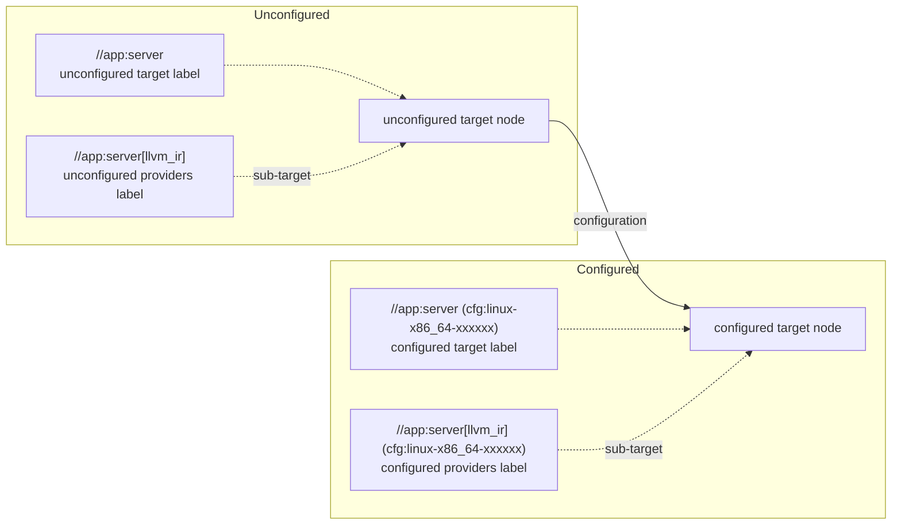

import useBaseUrl from '@docusaurus/useBaseUrl';

yak's labels and nodes are fundamental components that work together to
represent and track build targets in the build graph. Understanding how these
different types of labels and nodes relate to each other is essential not only
for writing BXL but also for working effectively with yak's architecture.

## Overview

yak uses several types of labels and nodes, each serving a specific purpose:

|              | target label                                                      | providers label                                                                                                     | node                                                              |
| ------------ | ----------------------------------------------------------------- | ------------------------------------------------------------------------------------------------------------------- | ----------------------------------------------------------------- |
| unconfigured | [TargetLabel](../../../api/build/TargetLabel)                     | [ProvidersLabel](../../../api/build/ProvidersLabel)                                                                 | [UnconfiguredTargetNode](../../../api/bxl/UnconfiguredTargetNode) |
| configured   | [ConfiguredTargetLabel](../../../api/build/ConfiguredTargetLabel) | [Label](../../../api/build/Label) (same as [ConfiguredProvidersLabel](../../../api/build/ConfiguredProvidersLabel)) | [ConfiguredTargetNode](../../../api/bxl/ConfiguredTargetNode)     |

**Note:** As part of our ongoing improvements, we are migrating to more explicit
type names. TargetLabel and ProvidersLabel will be renamed to include the
`Unconfigured` prefix for consistency.

The following diagram illustrates the relationships between these components:

## Key Distinctions

### Configured vs Unconfigured

In the targets build graph, yak operates with two main perspectives on build
targets: unconfigured and configured. You can refer
[execution model](../../concepts/architecture.md#execution-model) to
see these two phase in a yak build.

**Unconfigured** components are configuration independent representations. Think
of them as the blueprint of your targets. For example, `//app:server` is the
unconfigured target label of the `server` target.

**Configured** components, on the other hand, include all the platform-specific
details and other configurations needed for actual building. They have the
necessary information about how to build it for a specific platform or
configuration. For example, `//app:server (cfg:linux-x86_64-xxxxxx)` is the
configured target label of the `server` target.

### Labels vs Nodes

**Labels** are identifiers that uniquely reference targets in your build graph.
They're like addresses that tell yak which target you're talking about. For
example, `//app:server` is an unconfigured label that points to a specific
target.

**Nodes** contain the actual information about targets. They hold the data about
what a target is, what it depends on, what attributes it has, etc.

### Target Labels vs Provider Labels

**Target labels** (both configured and unconfigured) identify complete build
targets. For example, `//app:server` refers to an entire target.

**Provider labels** (both configured and unconfigured) represents a specific
part of a target. For example, `//app:server[llvm_ir]` represents the
`llvm_ir` sub-target of `//app:server`.

## Label and Nodes Conversion

This diagram shows how different components transform to each other using api

