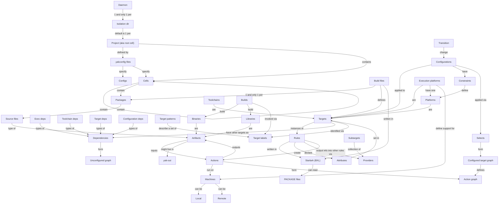

The Concept Map provides an at-a-glance overview of the relationships between
widely used yak concepts. It is meant to be a tool to help those onboarding to
yak to quickly gain an understanding of the yak environment.

:::note

The Concept Map is for reference only and is not intended to be 100% accurate
nor complete.

:::
