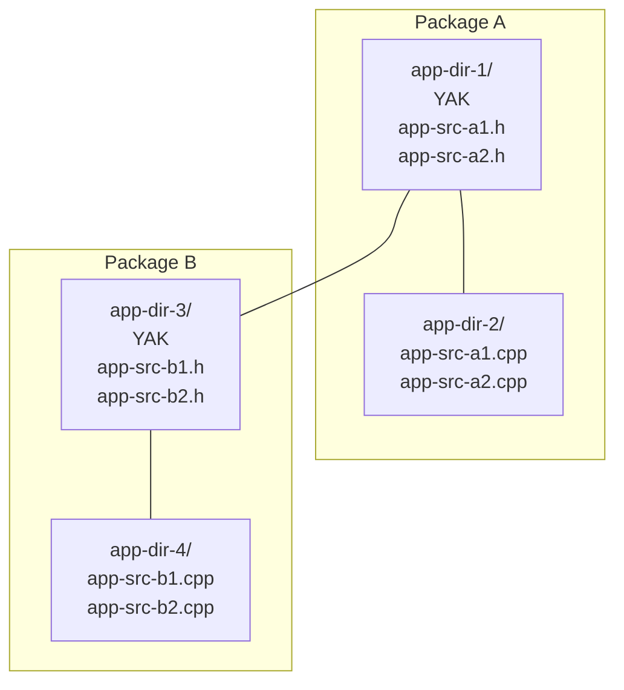

# Key concepts

yak has a number of fundamental concepts:

- A [**_build rule_**](build_rule.md) describes how to produce an output file
  from a set of input files. Most build rules are specific to a particular
  language or platform. For example, you would use the
  [`cxx_binary`](../../prelude/rules/cxx/cxx_binary) rule to create a C++
  binary, but you would use the
  [`go_binary`](../../prelude/rules/go/go_binary) rule to create a Go binary.
- A [**_build target_**](build_target.md) is a string that uniquely identifies a
  build rule. It can be thought of as a URI for the build rule within the yak
  project.
- A [**_build file_**](build_rule.md) defines one or more build rules. In yak,
  build files are typically named `YAK`. A `YAK` file is analogous to the
  `Makefile` used by the Make utility. In your project, you will usually have a
  separate `YAK` file for each buildable unit of software—such as a binary or
  library. For large projects, you could have hundreds of `YAK` files.

### Packages

A yak **_package_** is defined by:

- A yak build file (a `YAK` file) that marks the root of the package
- All files in the same directory as this `YAK` file
- All files in subdirectories, _unless_ those subdirectories contain their own
  `YAK` files

In other words, yak packages are hierarchical and non-overlapping: Each `YAK`
file creates a new package boundary. A package does not include subdirectories
that contain their own `YAK` files. Those subdirectories with `YAK` files
become roots of their own separate packages.

For example, in the following diagram, the YAK file in directory `app-dir-1`
defines that directory as the root of a package—which is labeled **Package A**
in the diagram. The directory `app-dir-2` is part of Package A because it is a
subdirectory of `app-dir-1`, but does not itself contain a YAK file. Now,
consider directory `app-dir-3`. Because `app-dir-3` contains a YAK file it is
the root of a new package (**Package B**). Although `app-dir-3` is a
subdirectory of `app-dir-1`, it is _not_ part of Package A.



### Cells

A yak **_cell_** is:

- A directory tree containing one or more yak packages
- Configured by a [**`.yakconfig`**](yakconfig.md) file at **its root**
  ```
  [cells]
  cell_name = path_to_cell
  ...
  ```
- Often (but not necessarily) corresponding to a repository

Note that although the cell root should contain a `.yakconfig`, the presence of
a `.yakconfig` file doesn't in itself define a cell. Rather, _the cells
involved in a build are defined at the time yak is invoked_; they are
specified in the `.yakconfig` for the yak _project_ (see below).

### Projects

A yak **_project_** is:

- The entry point for yak builds
- Defined by the `.yakconfig` file in the directory where yak is invoked (or
  in the nearest ancestor directory),
- The container that specifies which cells are part of the build

**_How cells and projects relate._** The project's `.yakconfig` specifies all
cells in the [cells](yakconfig.md#cells) section. The directory containing the
project's `.yakconfig` is automatically considered a cell. While not required,
it's good practice to explicitly list the project cell in the configuration.

### yak's dependency graph

Every build rule can have zero or more dependencies. You can specify these
dependencies using, for example, the `deps` argument to the build rule. For more
information about specifying dependencies, consult the reference page for the
build rule you are using. These dependencies form a directed graph, called the
_target graph_. yak requires the graph to be acyclic. When building the output
of a build rule, all of the rule's transitive dependencies are built first. This
means that the graph is built in a "bottom-up" fashion. A build rule knows only
which rules it depends on, not which rules depend on it. This makes the graph
easier to reason about and enables yak to identify independent subgraphs that
can be built in parallel. It also enables yak to determine the minimal set of
build targets that need to be rebuilt.

### Multiple yak projects in a single repository

yak is designed to build multiple deliverables from a single repository—that
is, a _monorepo_—rather than from multiple repositories. Support for the
monorepo design motivated yak's support for cells and projects. Maintaining
all dependencies in the same repository makes it easier to ensure that all
developers have the correct version of the code and simplifies the process of
making atomic commits.

### See also

Take a look at the [Concept Map](concept_map.md) for a visualization of how
yak concepts interact with each other. Also see the [Glossary](glossary.md).
